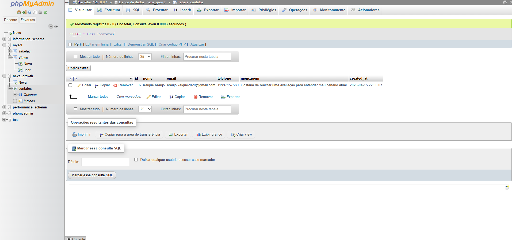

# 🚀 Teste Técnico - Landing Page Full Stack

## 📌 Sobre o projeto

Este projeto consiste em uma landing page para uma agência fictícia de marketing digital focada em performance.

O objetivo é capturar leads através de uma interface moderna e otimizada para conversão, integrando um formulário com backend em PHP e persistência em banco de dados.

A aplicação foi construída simulando um cenário real de captação de clientes no digital, com foco em clareza, performance e organização de código.

---

## 📸 Preview


---

## 🗄️ Persistência de dados



---

## 🌐 Deploy

A aplicação está disponível em produção:

👉 https://teste-frontend-developer.onrender.com/

---

## 💡 Funcionalidades

- Landing page responsiva  
- Seções estratégicas voltadas para conversão  
- Formulário de captura de leads  
- Integração com backend em PHP  
- Persistência de dados em banco de dados  
- Feedback visual no envio do formulário  

---

## 🛠️ Tecnologias utilizadas

### Frontend
- HTML5  
- CSS3  
- SASS  
- JavaScript  

### Backend
- PHP 8  

### Banco de dados
- MySQL  
- PostgreSQL  

### Infraestrutura
- Docker  
- Apache  

### Deploy
- Render  

---

## 🧱 Estrutura do projeto

```text
.
├── app/
│   └── Support/
├── database/
│   ├── schema.sql
│   └── schema-postgres.sql
├── docker/
│   └── Dockerfile.sass
├── public/
│   ├── assets/
│   │   ├── css/
│   │   ├── images/
│   │   └── js/
│   ├── index.php
│   └── submit.php
├── resources/
│   └── styles/
├── Dockerfile
├── docker-compose.yml
├── docker-compose.dev.yml
├── package.json
└── render.yaml
```

## Como rodar o projeto

Instalar as dependências:

```bash
npm install
```

Rodar o projeto com Docker:

```bash
docker compose up --build
```

## Estilos (SASS)

Build único:

```bash
npm run build:css
```

Modo desenvolvimento(watch):

```bash
npm run sass
```
## 🗄️ Banco de Dados

O backend suporta:

- MySQL  
- PostgreSQL  

### Schemas disponíveis

- `database/schema.sql`  
- `database/schema-postgres.sql`  

---

## ⚙️ Variáveis de ambiente

A aplicação utiliza as seguintes variáveis:

- `DB_DRIVER`  
- `DB_HOST`  
- `DB_PORT`  
- `DB_NAME`  
- `DB_USER`  
- `DB_PASS`  
- `DATABASE_URL`  

---

## 🐳 Docker

O projeto utiliza Docker com build multi-stage:

- Node.js → build do CSS (SASS)  
- PHP + Apache → servidor da aplicação  

## Observações

Projeto desenvolvido como parte de um teste técnico para vaga de estágio, com foco em demonstrar habilidades em desenvolvimento full stack, organização de código e boas práticas.

### Desenvolvido por Kaique

---